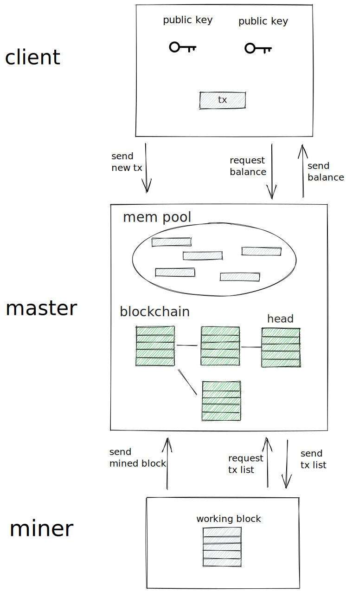
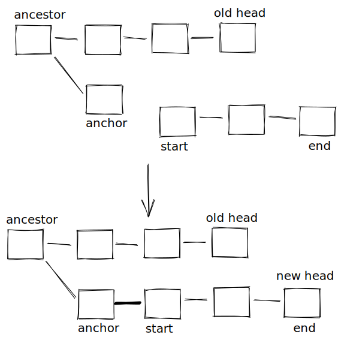

Welcome to the Babbage Coin project ! This project is about describing the blockckain fundamentals in the simplest way possible.

*Following the Projet Babbage philosophy, it started from scratch, and was initially built in a weekend.*

## Overview

The core of the package is written in python, allowing us to put an emphasis on readability of the code. We added comments, chart, and tried to keep dependencies manageable to help you navigate through it.

Design choices also skew towards the simplicity of the chain: it uses proof of work as its consensus algorithm and there is no virtual machine or scripting language associated.

The following diagram describes the overall structure of the project:

There are three main modules: **miner**, **master**, and **client**. We now describe those in more detail, and conclude by the **verification** of blocks validity.

## Miner

Hash functions produce an ouput that looks random, and their utility comes from the assumption that it is impossible to predict what the input was. Assuming that this is the case, the best strategy to find an input that produces a particular output is by brute force: try successively different inputs. Selecting a subset of outputs that is `d` times smaller than the subset of all possible outputs, there is a one in `d` times chance to be in the chosen subset.The parameter `d` is called the difficulty, and we say that an input respects the difficulty when its hash is in the chosen subset. In pratice, and in Babbage Coin, the output range is the set of all positive integers smaller than a constant `n`. We choose the subset of integers smaller than `n/d`, giving us subset of difficulty `d`. This way we can easily check if an output is in this set.

A block contains a list of transactions and a nonce. The nonce is simply an integer that is hashed as part of the block. The goal of the miner, for a given list of transactions, is to find a nonce such that the hash of the whole block respects the difficulty. When a miner finds such a nonce, we say that he mined a new block.

In order for the overall blockchain to be consistent, some other fields of a block are also hashed. Here are all the data that are hashed as part of a block:
- **nonce**, as we said this is an ad hoc parameter to be able to find a hash that respects the difficulty
- **list of transactions**, this is the payload of the block
- **hash of the previous block**, to ensure that there is a continuity of blocks
- **height**, this is the block number and should be incremented at every block

The miner is thus constantly trying to mine a block containing a list of transactions. Transactions also include a fee that is paid to the miner. To maximize the overall fee received if the block is eventually mined, the miner periodically asks the master for a new list of transactions. The idea is that the master provides the list with the maximum sum of fees.

## Master

The master uses a [Flask server]( https://flask.palletsprojects.com/) to receive block from the network, to broadcast new blocks from the miner, and to generally communicate with the client and the miner. 

The master keeps in memory a tree representing the whole blockchain. The head is the last block in a branch, and the protocol enforces that this block should have the maximum height among all the known blocks. The master also keeps in memory all the validated transactions, that is all the transactions from the genesis (initial) block, up to the head. Accounts also have a corresponding balance that is kept in memory. Finally, the mem pool is the set of all received, not yet validated transactions.

When the miner asks for a list of transactions, the master looks for them in the mem pool. When a new block is added after the head, this block becomes the head and its transactions are added to the validated transactions and removed from the mem pool. A similar behavior happens when new blocks are received from the network, except that the process can be repeated multiple times if the chain has some catching up to do.

Sometimes, two (or more) branches of the chain are live, and different miners are working on each one of them. If these nodes happen to communicate, the node with the lowest height head should switch to the competing branch. It requires to find a known block on which to add the new branch. This known block is called the anchor, and the node should switch to anchor as its new head before adding the new blocks. Considering the common ancestor of the previous head and the anchor, switching to anchor requires to removing the blocks between the previous head and the ancestor, and adding blocks between the ancestor and the anchor. The following diagram describes what happens when adding new blocks from `start` to `end`.

## Client

The client allows you to easily interact with the chain. Through it, you can perform the following actions.
- You can **create a new account**. The client generates a new wallet with a new public/private key pair.
- You can **transfer BBC from your account to another**. The client sends a new transaction to the master, who broadcasts it to every know nodes.
- You can **query any balance**. The clients sends a request to the master.

The front end also allows you to look at the whole blockchain (block explorer), and to request some free BBC (faucet).

## Verification

protocol enforced

TODO: describe all the verification that is done
