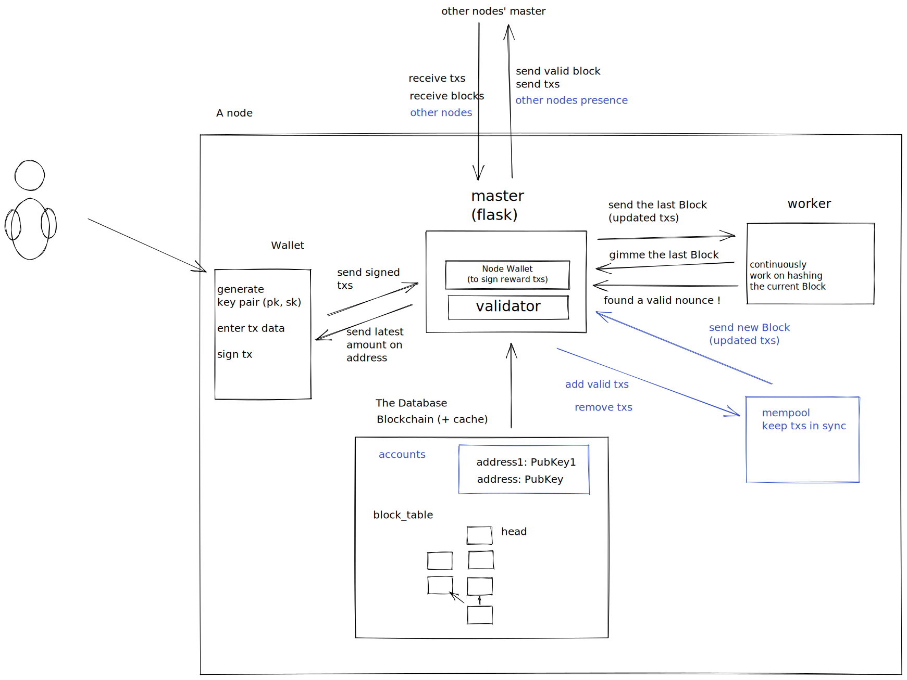

Welcome to the Babbage Coin project ! This project is about describing the blockckain fundamentals, and making it is as easy to understand as possible. It started from scratch, and was initially built in a weekend.

## Overview

The core of the package is written in python, allowing us to put an emphasis on readability of the code. We added comments, chart, and tried to keep dependencies manageable to help you navigate through it.

Design choices also skew towards the simplicity of the chain: it uses proof of work as its consensus algorithm and there is no virtual machine or scripting language associated.

The following graph describe the overall structure of the project.

There are three main modules: the master, the miner, and the client. We now describe those in more detail, and conclude by the verification of blocks validity.

## Hashing and miner

TODO:

- hashing algorithm
- what is hashed in a block
- what is the miner trying to hash, signed transactions

## Network and master

TODO:

- broadcast
- update_blockchain

## Client

TODO:

- create new account
- transfer
- faucet
- balance
- block explorer / recent activity

## Verification

TODO: describe all the verification that is done
